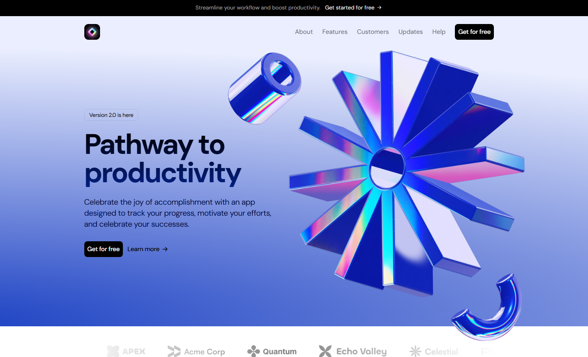

# Lumitrack 🚀

**Lumitrack** is a premium, light-themed SaaS landing page built for high-performance productivity applications. Designed with a focus on aesthetics and user conversion, it features a crisp blue-accented color palette, fluid Framer Motion animations, and a fully responsive architecture.

---

## ✨ Features

- **Modern Hero Section:** A bold "Pathway to productivity" introduction with 3.D animated elements (Cogs, Cylinders, and Noodle graphics).
- **Interactive Product Showcase:** Beautifully designed sections highlighting the "Boost your productivity" value proposition.
- **Dynamic Pricing Table:** A three-tier pricing model (Free, Pro, Business) designed for maximum CTR.
- **Animated Logo Ticker:** A seamless carousel showcasing social proof from industry leaders like Acme, Quantum, and Pulse.
- **Social Proof:** A dedicated Testimonials grid featuring reviews from over 9+ satisfied users.
- **High Performance:** Optimized for core web vitals using Next.js and TypeScript.

---

## 🛠 Tech Stack

- **Framework:** [Next.js](https://nextjs.org/)
- **Language:** [TypeScript](https://www.typescriptlang.org/)
- **Styling:** [Tailwind CSS](https://tailwindcss.com/)
- **Animations:** [Framer Motion](https://www.framer.com/motion/)
- **Icons:** Lucide React

---

## 🎨 Design System

Lumitrack uses a professional light-mode aesthetic:
- **Primary Blue:** `#183EC2`
- **Soft Accent:** `#D2DCFF`
- **Backgrounds:** Radiant gradients and clean white space for a premium feel.

---
